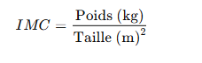

***Objectif:***

L’objectif est développer un calculateur de l’indice IMC( Indice Masse Corporelle) ,qui se calcule par la formule suivante:

avec cette formule,on calcule l'indice,le résultat est interpréte comme suit;

alors ,ce qui est demandé de notre part est de construire une interface comme suit qui sert a calculer et en meme temps interpreter le resultat trouvé,on va essayer de s'inspirer de ce qui est montré ici:

