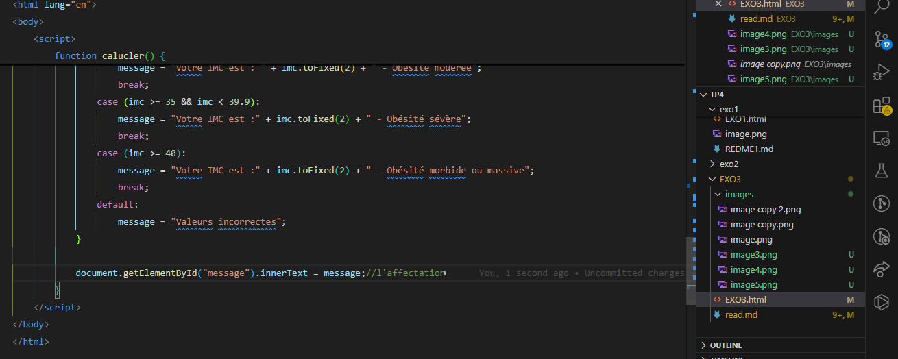

***Objectif:***

L’objectif est développer un calculateur de l’indice IMC( Indice Masse Corporelle) ,qui se calcule par la formule suivante:

avec cette formule,on calcule l'indice,le résultat est interpréte comme suit;

alors ,ce qui est demandé de notre part est de construire une interface comme suit qui sert a calculer et en meme temps interpreter le resultat trouvé,on va essayer de s'inspirer de ce qui est montré ici:

  

d'abord ,dans notre fichier html, on va essayer de créer le formulaire ,qui contient le titre,les deux zones de saisies ,et enfin un boutton pour le calcul.

pour l'architechture HTML ,j'ai crée le formulaire qui contient deux labels le premier du poids avec son input ,le deuxième pour la taille avec son input et n'oublions pas le button avec le on click de la fonction calculer qu'on va définir après dasn le script ,et n'oublions pas que nous voulons afficher un message et pour cela on deux méthodes soit alert mais ce n'est pas demandé,et la deuxième et créer un div qui va contenir le message :

***javascript***:

alors ,maintenat on doit déclarer la fonction Calculer(),d'abord on doit récupérer les deux valeurs saisies par l'utilisateur par parsefloat pour avoir le reele et non le string ,aussi on déclae la variable message comme string 
ensuite ,on crée la boucle Switch qui va supporetertous les cas demandées et à chaque cas ,on interprète comme demandé,et chaque interprtation est affecté a le div message:

***la boucle***

***l'ajout du style***

pouerle style j'ai essaye de mettre comme demandé de l'exercice :
enfin on va avoir comme ca:

