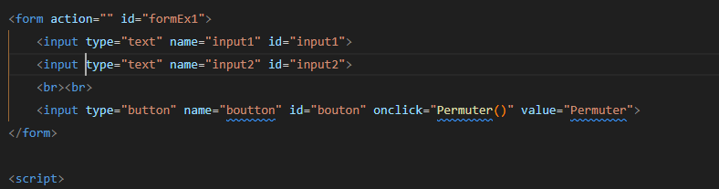
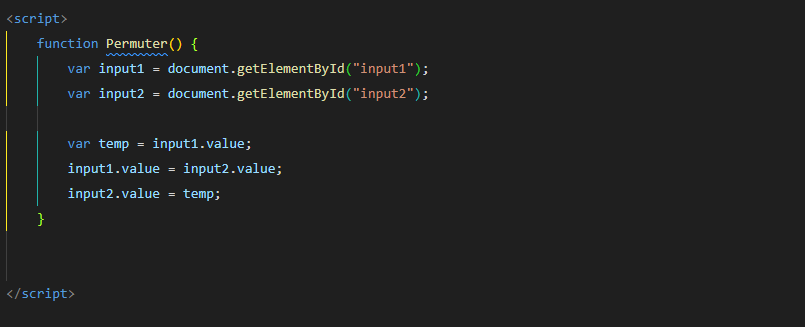
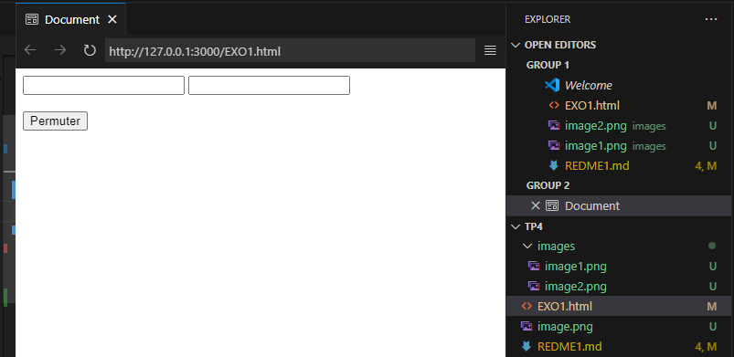
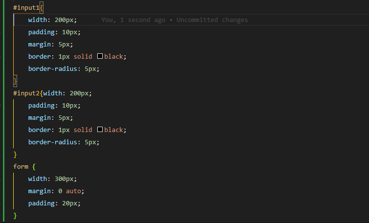
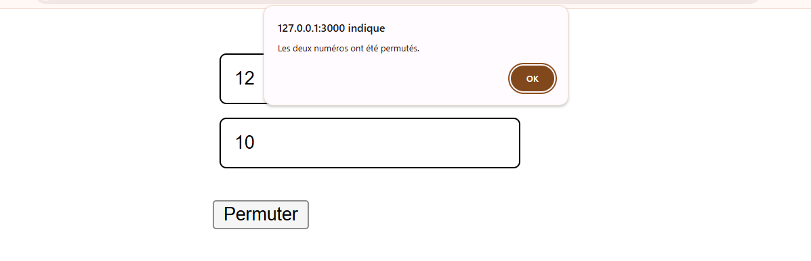

***Objectif: Permutation***
**** L'objectif est de créer unformulaire qui contient deux zones de texte et un bouton de commande. Le fait de cliquer
sur le bouton permute le contenu des deux zones de texte.
***Aperçu: On met deux textes différents dans les deux zones de texte puis cliquez sur lebouton.****
d'abord on fait notre architechture Html du formulaire avec les deux inputs comme indiqué dans la capture:

***l'ajout du l'évenenment avec le script java script***

ici, ona essayé de créer une fonction permuter qui va s'activer ,le moment ou on clicke sur le bouton permuter.
enfin on a le résultat suivant;

***le style***:
On peut ajouter plus de style sur notre formulaire  comme suivant:
 
 

  
