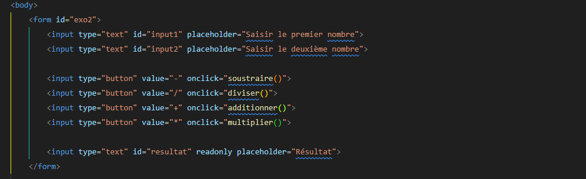
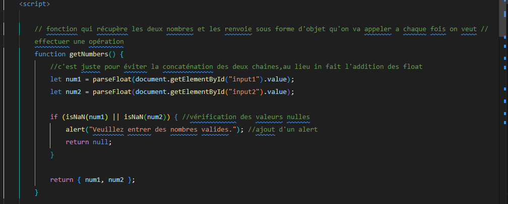
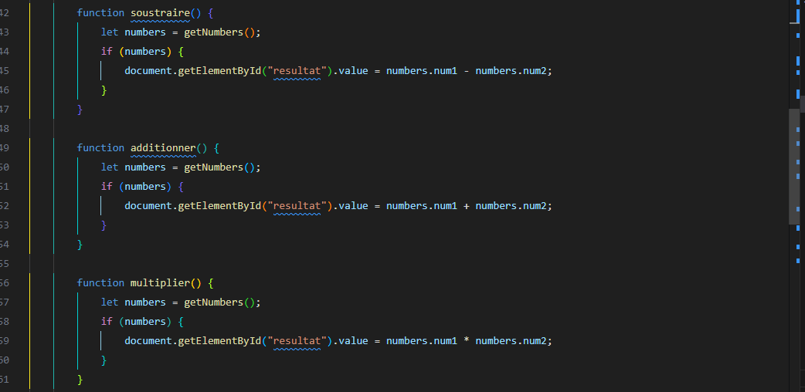
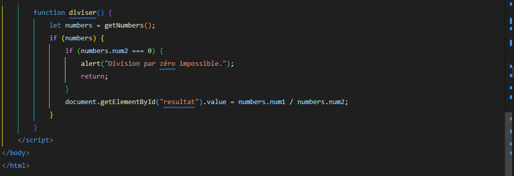
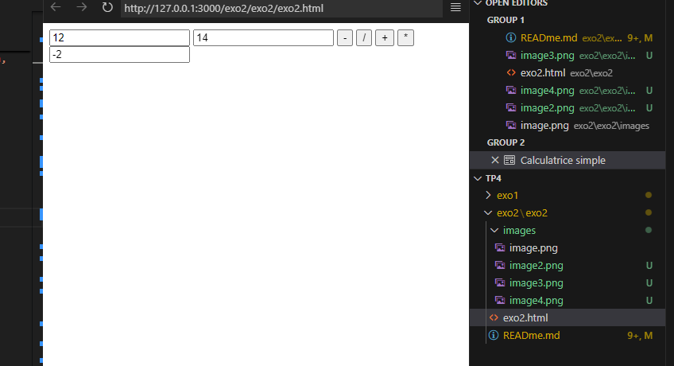
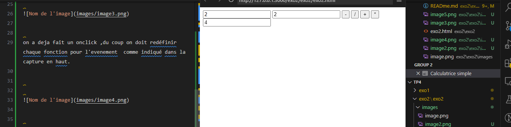
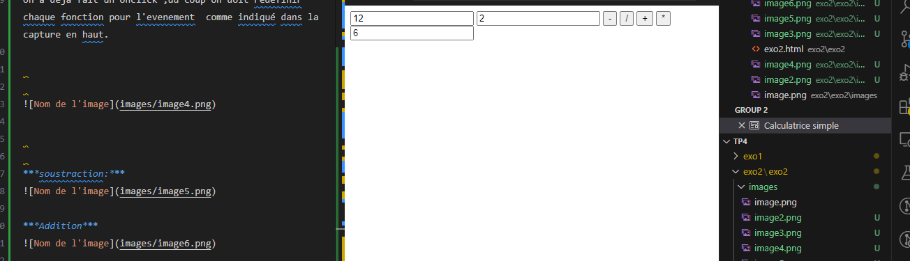
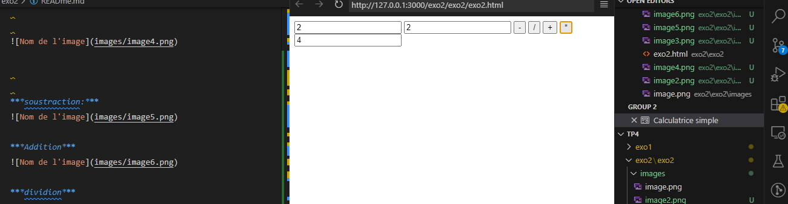
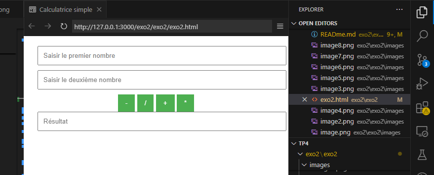

***Exercice2:***
***Dans cet exercice, on va essayer de créer une calculatrice qui exécute les opérations basiques, à savoir, addition, soustraction, multiplication et division. La page contiendra trois zones de texte qui représenterons respectivement: nombre 1, nombre 2 et résultat de l'opération, ainsi que 4 boutons qui représenteront les 4 opérations prévues.***

***Analysons le fichier Html:***

ici ,j'ai essayé de mettre les deux cases pour l'input des deux nombres qu'on va effectuer sur eux les quatres opérations:
aussi ,quatre buttons avec chacune sa placeholder approprié,et enfin une cellule pour le résulatat.

***le script ***

ici , on a commenceé par la fonction de récupération des deux nombres saisies par l'utilisateur  ,pour éviter la concaténation des deux chaines ,car n'oublions pas que dans le type de chaque input on a écrit type="text",du coup si on a pas spécifié qu'on est besoin d'une récupération sous forme de fmloat,on va aecontrer le problème suivant ;
2+2=22 au lieu de 4

on a deja fait un onclick ,du coup on doit redéfinir chaque fonction pour l'evenement  comme indiqué dans la capture en haut.

***soustraction:***

***Addition***

***dividion***

***Multiplication***:

***le style***:

