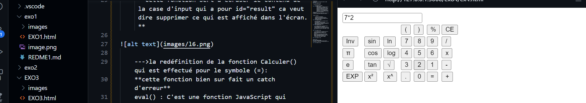

***objectif***
-->***réaliser une calculatrice Avancéé comme suivant:***

 
  ***construction HTML***
    
      --->création de la table:

            dans ce code ,on a essayé de créer la construction de notre tableau ,qui contient d'abord :l'input de résultat spécifié par readonly car on va pas modifier cher lui,on va juste lire le résulatats et les symboles saisies ,ensuite on a crée les lignes de notre tableau, pour qu'ils soient meme chose que l'exercice demande.
**Remarque**
--->tous les fonctions indiqués dans onclick on va les redéfinir dans notre script par la suite.

 ***java script***

       --->Analyse des fonctions:
       **Pour tous les nombres qu'on veut travailler avec on utilise la fonction ajouter(),aussi pouer les symboles et les fonctions prédéfinies**

       
      --->la redéfinition de la méthode ajouter()dans notre script:
      **ici deja dans l'interface pour l'utilisateur va saisir le symbole ou bien le nombre donc deja la fonction va récupérer la valeur (==nombre ou symbole) .

     --->la redéfinition de la méthode effacer() qui est effectué par le symble CE:
     **cette fonction sert a ecraser le contenu de la case d'input qui a pour id="result" ca veut dire supprimer ce qui est affiché dans l'écran.**

    --->la redéfinition de la fonction Calculer() qui est effectué pour le symbole (=):
    **cette fonction bien sur fait un catch d'erreur**
    eval() : C'est une fonction JavaScript qui prend une chaîne de caractères et l'évalue comme du code JavaScript. Dans ce cas, il va évaluer l'expression mathématique que l'utilisateur a entrée dans le champ.

**avant css**

**vérifions le fonctionnement de notre code**
***calculons la valeur de la multiplication de 7*2:***

***le résultat trouvé***

*le code fonctionne bien*:
**Après css **

--->Appliquons du style sur le body:
**font-family: Arial, sans-serif;**
c'est pour déterminer le style d'écriture
**background-color: #f4f4f4;**on a essayé de choisir une couleur simple et non dérangente :
**disaplay:flex**:pour que notre table peut s'adapter a l'espace disponible

--->Appliquons du style sur le Container par le thème Grid:

***pourquoi le thème grid***
CSS Grid permet de créer des grilles à plusieurs dimensions (lignes et colonnes), ce qui est parfait pour les mises en page complexes. Tu peux facilement gérer des éléments de tailles différentes et les disposer précisément dans une structure en ligne et en colonne.

***le résultat final est comme suivant***

